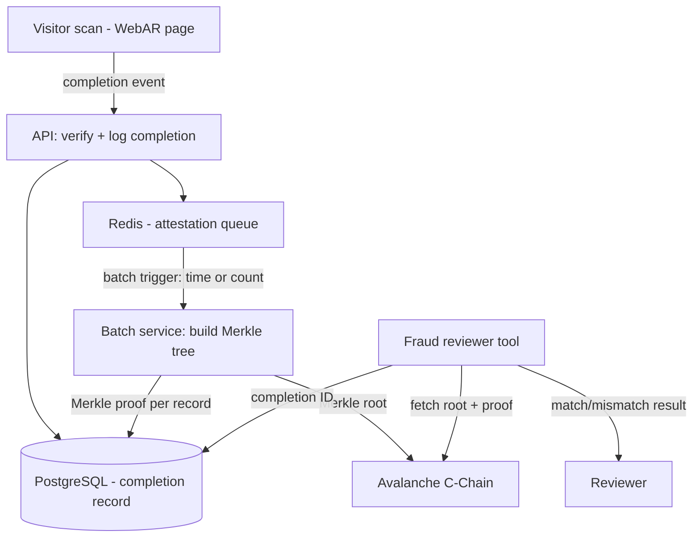

# PIKE — On-Chain Completion Attestation (Avalanche)
**Addendum to PIKE v1 PRD — Feature: Scan Marker (WebAR verification), Section 8.5**
Status: Draft, July 2026

---

## 1. Overview

This PRD scopes a single, narrow addition to the existing scan-marker verification system: writing a tamper-evident hash of every completion event to the Avalanche C-Chain. It does not change how completions are recorded, verified, or rewarded — Postgres and Redis remain the source of truth for redemption logic, caps, and expiry (per NFR "Security" in the parent PRD). This is a verification layer bolted on top, not a replacement for anything.

This directly answers the open question in Section 14 of the parent PRD — *"who owns fraud review for flagged completions"* — by giving whoever owns that job a tamper-evident record to review against, regardless of whether that's a manual process today or tooling later.

## 2. Problem

Section 8.5 of the parent PRD treats marker recognition (vs. plain QR) as the core fraud barrier, but the record of *that a completion happened* still lives only in a database the PIKE team controls. If a completion record is altered after the fact — by a bug, an insider, or a compromised admin account — there's currently no independent way to detect it. A tamper-evident, append-only log of completion hashes gives fraud reviewers (and, if it ever matters, venue owners disputing a redemption-cap dispute) something to check the database against that PIKE itself can't quietly rewrite.

## 3. Goals

- Give every completion event a tamper-evident, independently verifiable timestamp and content hash.
- Do this without adding latency to the visitor-facing scan-to-reward flow (NFR: sub-3-second round trip in the parent PRD is not negotiable).
- Do this without putting any personal or location data on a public chain.
- Keep cost predictable and low even as completion volume scales into the thousands/day.

## 4. Non-Goals (v1 of this feature)

- Fraud *detection* logic (anomaly scoring, automated flagging) — this feature only makes records tamper-evident; deciding what's suspicious is a separate, later effort.
- On-chain storage of raw device signal, marker images, or any PII — only hashes go on-chain.
- Reward NFTs / badges / VIP-pass tokenization — that's a separate feature (see the "reward wallet on-chain" recommendation), not this one.
- Client-side blockchain interaction of any kind — the visitor's browser never touches Avalanche, directly or indirectly.
- A dedicated Avalanche L1 for PIKE — this uses the shared C-Chain; a purpose-built L1 is a Horizon 2+ conversation.

## 5. Users

| User | Need |
|---|---|
| Fraud reviewer (internal, manual for now per parent PRD's open question) | A way to confirm a completion record hasn't been altered since it was logged |
| Venue owner | Confidence that redemption-cap enforcement and completion counts aren't quietly editable after a dispute |
| Engineering/ops | An audit trail that doesn't require trusting the app's own database in a security incident |

## 6. Success Metrics

- **Attestation coverage**: % of completion events (FR-13) that have a confirmed on-chain hash within the batching window.
- **Verification latency**: time from completion event to on-chain confirmation (batch-level, not per-event — see 8.2).
- **Cost per completion**: on-chain cost divided by completion volume; should trend toward near-zero as batching absorbs fixed costs.
- **Zero added latency** to the visitor-facing scan-to-reward flow (this is a pass/fail gate, not a trend to optimize).
- **Dispute resolution time**: for the small number of flagged/disputed completions, time to confirm or refute against the on-chain record.

## 7. How It Works

### 7.1 What gets hashed

Per completion event, the backend computes a hash of:
- marker ID
- venue ID and quest ID
- device/session signal (the same signal already logged per FR-13)
- server-side timestamp

No raw device signal, phone number, or location data is ever written to the chain — only the hash. Raw data stays in Postgres, exactly as it does today; the chain only proves that record hasn't changed since it was written.

### 7.2 Batching, not per-event writes

Writing one transaction per completion doesn't scale and isn't necessary for the tamper-evidence goal. Instead:
1. Completion hashes accumulate in a queue (Redis, reusing existing infrastructure).
2. Every N minutes (or every N completions, whichever comes first), the backend builds a Merkle tree from the batch and writes only the Merkle root to Avalanche — one transaction covers thousands of completions.
3. Each individual completion record in Postgres stores its Merkle proof, so any single completion can be verified against the on-chain root without needing the whole batch.

This keeps cost and latency off the critical path entirely — visitors get their reward the moment recognition succeeds (unchanged from today); the attestation happens asynchronously afterward.

### 7.3 Who writes to chain

A backend service — not the client, not the WebAR page — owns the wallet that submits batch roots. This preserves the zero-install, zero-friction visitor flow (Section 8.2 of the parent PRD) untouched; nothing about the visitor experience changes.

### 7.4 Verifying a record

A lightweight internal tool (or a dashboard panel) lets a fraud reviewer paste a completion ID and get back: the stored hash, the Merkle proof, the on-chain root it should belong to, and a pass/fail check that they match. This is the concrete answer to "who owns fraud review" — whoever does, they now have a tool, not just a database they have to trust.

## 8. Functional Requirements

- FR-A1: Every completion event logged under FR-13 must be queued for on-chain attestation without blocking the reward-reveal response to the visitor.
- FR-A2: Completion hashes must exclude PII and raw location data — hash inputs are limited to marker ID, venue ID, quest ID, device/session signal, and timestamp.
- FR-A3: Batches must be written to Avalanche on a fixed cadence (time- or count-based, whichever triggers first) with the batch window configurable without a deploy.
- FR-A4: Each completion record must store a Merkle proof sufficient to verify inclusion in its batch's on-chain root independently of the rest of the batch.
- FR-A5: A verification tool must let an internal user confirm any single completion's hash against its on-chain root on demand.
- FR-A6: If the on-chain write fails or Avalanche is unreachable, completions must still process normally (reward reveal, redemption-cap enforcement) — attestation failure must never block the core flow, only get retried.
- FR-A7: The wallet/key used to submit batch roots must be backend-held and never exposed to any client, dashboard user, or venue owner.

## 9. Tech Stack

| Layer | Choice | Why |
|---|---|---|
| Chain | Avalanche C-Chain | EVM-compatible, sub-second finality, no need for a dedicated L1 at this volume |
| Write path | Backend service (Node/TypeScript, same stack as the API) | Keeps wallet custody server-side only |
| Wallet infra | thirdweb or a direct ethers.js/viem integration with a backend-held key | Simple service wallet is sufficient — no user-facing wallet UX needed for this feature |
| Batching/queue | Redis (existing) | Reuses infrastructure already in the stack for redemption-cap counters |
| Merkle tree | Standard library (e.g., merkletreejs) | Well-understood, auditable, no custom crypto |
| Gas | Sponsored by the service wallet, funded and monitored like any other operating cost | Predictable, small — batching keeps per-completion cost near-zero |

## 10. Architecture

## 11. Non-Functional Requirements

- **Latency**: zero added latency to the visitor-facing scan-to-reward round trip — attestation is fully asynchronous.
- **Privacy**: no PII, raw device signal, or location data ever leaves Postgres; only hashes reach the chain.
- **Cost predictability**: batching keeps on-chain cost roughly flat regardless of per-venue completion volume; monitor cost-per-completion as venue count grows.
- **Resilience**: Avalanche downtime or write failures degrade to "retry later," never to blocking the core reward flow.
- **Auditability**: any completion's attestation status (pending, confirmed, failed-and-retrying) must be visible to internal tooling.

## 12. Risks

| Risk | Mitigation |
|---|---|
| Batch write fails silently, attestation coverage drops without anyone noticing | Alert on attestation-coverage metric (Section 6) falling below a threshold |
| Gas cost creeps up unnoticed as volume scales | Track cost-per-completion as a standing metric, not just at launch |
| Backend wallet key compromised | Standard key-management practice (secrets manager, rotation) — same bar as any other backend credential, no special blockchain exception |
| Team over-invests in this before fraud review even has a process (per parent PRD's open question) | Ship the verification tool (FR-A5) alongside the attestation pipeline, not after — the tool is the actual point of this feature |

## 13. Open Questions

- What batch window (time or count threshold) balances cost against how "fresh" reviewers need attestation to be for a live dispute?
- Does fraud review end up manual (per the parent PRD's current assumption) or does this feature's existence change that calculus enough to justify review tooling sooner?
- Is there any value in exposing a public, unauthenticated version of the verification tool (e.g., a venue owner checking their own redemption count wasn't altered), or does that stay internal-only for v1?

## 14. Phased Rollout

1. **Phase A**: backend hashing + Redis queue + batch Merkle writes to Avalanche (no reviewer tooling yet — confirm the pipeline works and cost holds up).
2. **Phase B**: internal verification tool (FR-A5) — this is the actual deliverable that makes Phase A useful.
3. **Phase C**: alerting on attestation coverage and cost-per-completion as standing operational metrics.