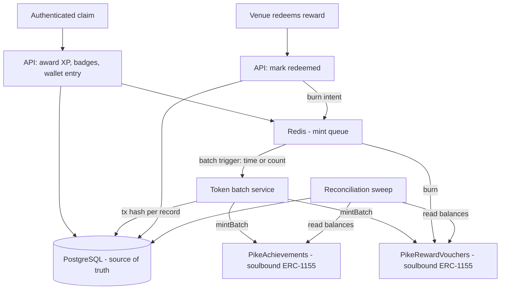

# PIKE — Soulbound Token Layer (Avalanche)
**Addendum to PIKE v1 PRD — Features: The App (section 7) and Scan Marker (section 8)**
Status: Draft, July 2026

---

## 1. Overview

This PRD scopes two smart contracts that put PIKE's existing gamification and reward state on-chain as **non-transferable (soulbound) ERC-1155 tokens**:

- **`PikeAchievements`** — the *gamification mechanics* contract. Badges and level milestones a user has earned.
- **`PikeRewardVouchers`** — the *tokenized incentives* contract. Reward-wallet entries, minted on claim and burned on redemption at the venue.

It does not change how XP, badges, streaks, quests, or redemptions are computed. Postgres remains the source of truth for every one of them, exactly as it does today (ADR 0003, ADR 0005). These contracts are a **mirror**, not a migration: on-chain state is derived from Postgres, written asynchronously, and never read back into the reward or cap-enforcement path.

This is a deliberate revision of two earlier non-goals — the v1 PRD's "reputational only, no shared currency" framing of FR-7, and the on-chain attestation PRD's exclusion of reward tokenization (its section 4). Section 3 below explains what changed and, more importantly, what did not.

## 2. Problem

Two gaps, one for each contract.

**Achievements are unprovable outside PIKE.** A user's badges, level, and streak history exist only as rows in a database PIKE controls. A user who has completed forty quests across a dozen venues has built something real, and today it is worth exactly nothing the moment they stop using the app, and provable to nobody who doesn't take PIKE's word for it. The attestation layer (ADR 0006) made *completions* tamper-evident; it did nothing for the identity built on top of them.

**Reward redemption has no receipt.** When a venue honors a VIP pass, the entire record is PIKE marking a row as used. There is no artifact the venue holds, nothing the user can show, and nothing either party can verify independently if the other disputes it. A burn transaction is a redemption receipt neither side can forge or retract.

## 3. What changes, and what explicitly does not

The v1 PRD chose "reputational only (no monetary value, no shared currency)" as its answer to portable rewards *without fintech complexity*. That reasoning still holds, and **soulbound tokens preserve it**: a token that cannot be transferred cannot be sold, traded, farmed for resale, or accumulated as a currency. It is reputation with a public, portable proof attached.

Unchanged by this PRD, and non-negotiable:

- **No transferability.** Neither contract permits transfer between holders. Not gated, not permissioned — the transfer path reverts (FR-T3).
- **No currency, no fungible balance, no market.** There is no PIKE token. There is no exchange rate. Vouchers are not redeemable for anything except the specific reward they name, at the specific venue that issued it.
- **No user-facing wallet UX.** The visitor's browser and the app never touch Avalanche, in either direction (carried forward verbatim from the attestation PRD's section 4). No seed phrases, no signing prompts, no gas, no wallet-connect.
- **No change to the claim flow.** Minting is asynchronous and off the critical path. The scan-to-reward round trip is untouched (NFR below).
- **Postgres stays authoritative.** Cap enforcement, expiry, eligibility, and the reward wallet all read from Postgres. If Avalanche is unreachable for a day, every user-facing feature works normally.

What this does *not* resolve, and should not be claimed to: because tokens are minted to custodial addresses PIKE controls (section 5), a user cannot today take their achievements to a wallet PIKE cannot reach. Section 5 scopes that as an explicit later phase rather than pretending it is solved.

## 4. Users

| User | Need |
|---|---|
| Consumer | Achievements that survive PIKE and can be shown to someone who doesn't trust PIKE |
| Venue owner | A redemption receipt that neither party can forge, retract, or quietly edit after a dispute |
| Fraud reviewer | Reward issuance and redemption visible on the same public record as completion attestations (ADR 0006) |
| Engineering/ops | One mint/burn path, derived from existing Postgres state, that cannot corrupt that state if it fails |

## 5. Custody: how users hold tokens without wallets

PIKE's entire funnel rests on a stranger claiming a reward with a phone number and no download. Introducing wallet onboarding would destroy the product's central advantage, so it is out of the question.

**Decision: deterministic custodial addresses.** The backend holds one HD seed. Each user's address is derived from that seed at a path fixed by their user ID, so:

- The address is stable, reproducible, and requires no per-user key storage.
- Minting targets a real, distinct on-chain address per user — not a shared pool, not a placeholder.
- The user is never shown a key, a seed phrase, a gas prompt, or the word "wallet."

The honest tradeoff: this is custodial. PIKE can, technically, act as any user. The soulbound constraint blunts the consequence — there is nothing transferable to steal, and the only privileged action is minting or burning a user's own non-tradeable record — but it is a real limitation and is recorded as such in FR-T9 and the risk table.

**Export is a later phase, not v1.** Letting a user bind their derived address to a self-custodied wallet they control is the natural Phase D, and the address derivation is designed so that becomes an additive change rather than a migration.

## 6. Success Metrics

- **Mint coverage**: % of badge awards and reward claims with a confirmed on-chain mint within the batch window.
- **Burn coverage**: % of redeemed rewards with a confirmed burn.
- **Zero added latency** to the scan-to-reward round trip — pass/fail gate, identical to the attestation PRD's.
- **Cost per mint**: on-chain cost divided by mint volume; should fall as batching absorbs fixed cost.
- **Divergence rate**: on-chain state disagreeing with Postgres during reconciliation sweeps — target zero, alert on any.

## 7. How It Works

### 7.1 `PikeAchievements` — gamification mechanics

ERC-1155, soulbound. One token ID per achievement definition; balance is 0 or 1.

| Token ID range | Meaning | Source of truth |
|---|---|---|
| `1–999` | Badges, one ID per `BADGE_DEFINITIONS` key | `apps/api/src/gamification/badges.ts`, `user_badges` rows |
| `1000–1999` | Level milestones (level 5, 10, 25, 50) | `User.xp`, 100-XP bands per ADR 0005 |
| `2000–2999` | Macro-quest completions, one ID per macro-quest | `MacroQuestCompletion` rows |

**XP itself is not tokenized.** It changes on every claim, which would mean a transaction per completion — the exact per-event write pattern the attestation PRD rejected as unnecessary and unscalable. XP stays in Postgres; only the milestones it crosses are minted.

The badge ID mapping is fixed and additive: a new badge takes the next unused ID, and existing IDs are never reassigned. That mapping is stored in code alongside `BADGE_DEFINITIONS`, not derived from array order, so inserting a badge in the middle of the list cannot silently renumber earned tokens.

### 7.2 `PikeRewardVouchers` — tokenized incentives

ERC-1155, soulbound. One token ID per *quest* (and per macro-quest reward tier), so all vouchers for the same reward share an ID and the contract's supply reflects real issuance per quest.

- **Mint** when a redemption reaches `claimed` — the same event that puts the reward in the wallet today.
- **Burn** when the reward is redeemed at the venue. The burn transaction hash is the receipt, stored back on the redemption row.
- **Expiry is not enforced on-chain.** Expiry is a Postgres concern (FR-3, FR-11) and stays there; an expired voucher is simply never burned, and the wallet stops surfacing it. Putting time logic on-chain would add contract surface for no verification benefit.

High-value rewards (`rewardTier: high_value`, FR-12) are the ones this matters most for, since those are already app-only and authenticated — but both tiers mint, because a venue disputing a discount count benefits from the same receipt.

### 7.3 Write path

Identical in shape to the attestation pipeline, and deliberately so — it reuses the queue, scheduler, retry, and reconciliation patterns already built and tested in `apps/api/src/attestation`:

1. A badge award or reward claim enqueues a mint intent in Redis. The user-facing response has already returned.
2. A scheduled batch job drains the queue and submits mints in batched calls (`mintBatch`), one transaction covering many users and token IDs.
3. Transaction hashes persist back to Postgres per record; failures retry on backoff and never block anything user-facing.
4. A reconciliation sweep re-enqueues any row whose on-chain state is missing — the same orphan-recovery approach ADR 0006 uses.

### 7.4 Who writes to chain

The same backend-held service wallet pattern as `AttestationRegistry`: both contracts are `Ownable`, and only the backend ever calls mint or burn. No client, dashboard user, or venue owner can reach either contract's write path.

Whether the token contracts share the attestation service wallet or use a separate one is an open question (section 12) — separate keys limit blast radius, one key is simpler to fund and monitor.

## 8. Functional Requirements

- **FR-T1**: Every `user_badges` row created must result in exactly one `PikeAchievements` mint to that user's derived address, idempotently — re-running a mint must never double-issue.
- **FR-T2**: Every redemption reaching `claimed` must mint exactly one `PikeRewardVouchers` token; every redemption marked redeemed must burn exactly one.
- **FR-T3**: Both contracts must revert on any transfer between holders. Mint (from zero address) and burn (to zero address) are the only permitted balance changes.
- **FR-T4**: No PII may be written on-chain — not phone numbers, emails, usernames, venue addresses, or location. Token IDs and derived addresses only.
- **FR-T5**: Minting and burning must be fully asynchronous and must never block, delay, or fail a claim, redemption, badge award, or reward-wallet read.
- **FR-T6**: If Avalanche is unreachable, all user-facing gamification and reward features must continue to work unchanged, with mints queued for retry.
- **FR-T7**: A user's derived address must be deterministic from their user ID and reproducible after a backend restart without per-user key storage.
- **FR-T8**: Account deletion (PRD §13) must not require an on-chain write. Deleting a user removes the Postgres identity; the derived address is orphaned and its soulbound tokens become permanently unattributable, consistent with the existing anonymization approach for redemptions.
- **FR-T9**: The custodial seed must be backend-held, never exposed to any client, and held to the same rotation and secrets-management bar as `ATTESTATION_WALLET_PRIVATE_KEY` — with the same standing gap acknowledged (no secrets manager in the repo yet).
- **FR-T10**: A reconciliation job must detect and report divergence between Postgres badge/reward state and on-chain balances.

## 9. Architecture

## 10. Non-Functional Requirements

- **Latency**: zero added latency to the scan-to-reward round trip. Minting is asynchronous, always.
- **Privacy**: no PII on-chain. Derived addresses are pseudonymous and are never published alongside user identity.
- **Resilience**: chain unavailability degrades to "retry later," never to a blocked claim or an empty wallet.
- **Cost predictability**: batched mints keep per-user cost near-zero; cost-per-mint is a standing metric.
- **Consistency**: on-chain state is eventually consistent with Postgres, never authoritative over it. Any divergence resolves in Postgres's favor.

## 11. Risks

| Risk | Mitigation |
|---|---|
| Custodial seed compromised | Nothing transferable exists to steal; attacker can only mint/burn non-tradeable records. Same rotation bar as every other backend secret; separate key from the attestation wallet under consideration (section 12) |
| Token IDs silently renumbered when a badge is added | ID mapping is explicit and additive in code, never derived from array position; a test asserts existing IDs never change |
| On-chain and Postgres state diverge unnoticed | Reconciliation sweep (FR-T10) with divergence as an alerting metric, not a periodic manual check |
| "Soulbound" is quietly relaxed later to enable a feature | Transfer reverts at the contract level, so relaxing it requires a redeploy and a new ADR — not a config change |
| Tokenization is read as "PIKE has a token" by users, regulators, or press | Positioning discipline: no currency, no market, no exchange rate, nothing transferable. Say "proof," never "token," in user-facing copy |
| Store-policy exposure if tokens ever gain monetary value | Non-transferability is what keeps this outside Apple/Google IAP scope (v1 PRD §13). Any future transferability proposal must re-open that analysis first |
| Effort diverted from FR-6 delivery and device testing, which gate launch | Phases A–B are contract-only and touch no existing runtime path; Phase C wiring should not start before push delivery ships |

## 12. Open Questions

- Do the token contracts share the attestation service wallet, or use a separate key? (Blast radius vs. funding and monitoring simplicity.)
- Should level-milestone tokens be revocable if XP is ever corrected downward, or is a minted milestone permanent regardless?
- Does the venue-facing burn need a dashboard action, or does it stay implicit in the existing redemption flow?
- Is there value in a public, unauthenticated page rendering a user's achievements from chain — and does that reintroduce the user-facing wallet UX this PRD rules out?
- When export-to-self-custody (section 5) arrives, does a soulbound token even survive the move, or does it need a rebind-and-reissue path?

## 13. Phased Rollout

| Phase | Scope | Output |
|---|---|---|
| **A** | Both contracts written, unit-tested in `packages/contracts` (soulbound enforcement, mint/burn, ID stability) | Compiling, tested contracts — no deploy |
| **B** | Deploy both to Avalanche Fuji testnet | **The two contract addresses** |
| **C** | Backend wiring: derived addresses, Redis mint queue, batch service, reconciliation | Mints and burns flowing on testnet |
| **D** | Export to self-custodied wallets; public achievement rendering (pending section 12) | — |
| **E** | Mainnet promotion after a soak period and an external review of both contracts | Mainnet addresses |

Phases A and B deliver deployed addresses without touching a single existing runtime path — no migration, no change to the claim flow, nothing that can regress the demo. Phase C is where this feature starts carrying risk, and it should queue behind the FR-6 push-notification delivery work already in flight.

Mainnet (Phase E) should not precede an external review. These contracts are small, but unlike `AttestationRegistry` they hold state users care about, and an ID-mapping bug is permanent.
