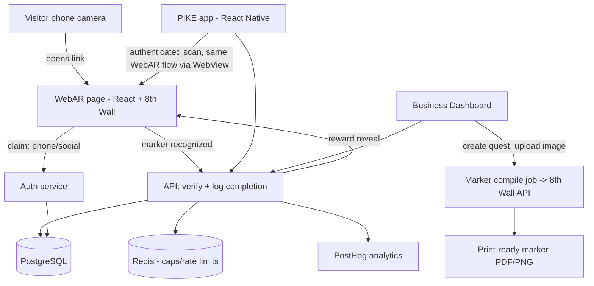

# PIKE — v1 Product Requirements Document
**App + Scan-Marker (WebAR) Feature**
Status: Draft · Working document, July 2026

---

## 1. Overview

PIKE turns a physical visit to a restaurant, live event, or entertainment venue into a quest. This PRD scopes the two pieces of v1 that carry the platform's core mechanic: the **PIKE app** (the identity/XP/reward home base) and the **scan-marker feature** (the marker-based WebAR verification that proves a visitor was physically present). Everything here is scoped to what a small team can ship in a few months, per the existing platform plan — multiplayer, persistent/VPS AR, and a quest marketplace are explicitly out of scope (Horizon 2/3).

## 2. Problem

Loyalty and discount tools give venues no way to build real engagement, and venues have no affordable path to anything more sophisticated than a static QR discount. Visitors have no reason to explore a venue beyond the transaction they came for. PIKE needs a verification mechanic that's (a) cheap enough for a local business to self-serve, (b) hard enough to spoof that rewards stay trustworthy, and (c) an identity layer that turns a one-off visit into a returning user.

## 3. Goals

- Ship a zero-install first touch that converts a walk-by stranger into a completed quest in under 90 seconds.
- Ship an app that becomes the durable home for identity: XP, streaks, reward wallet, and one cross-venue macro-quest.
- Ship a marker-based verification system that is meaningfully harder to spoof than a QR code or GPS check-in, and that a non-technical venue owner can set up without developer help.

## 4. Non-Goals (v1)

- Persistent/world-locked AR (VPS) — licensed later (Niantic Lightship, 8th Wall), not built in-house.
- GPS/geofence-only verification — too imprecise indoors, trivially spoofed.
- Multiplayer, NPC dialogue, guilds, friend challenges.
- Sponsored quests, cross-venue shared currency, quest/asset marketplace.
- AI-driven dynamic difficulty or personalization (needs usage data we won't have yet).

## 5. Users

| User | Need |
|---|---|
| First-time visitor | Try a quest with no friction — no app, no account, no waiting |
| Repeat visitor | A reason to come back — streaks, saved rewards, favorite-venue notifications |
| Venue owner (non-technical) | Create a quest, print a marker, set reward caps, see basic analytics — no developer |

## 6. Success Metrics

- **Funnel conversion**: % of marker scans that complete the quest and claim a reward.
- **App attach rate**: % of reward claimants who install the app within 7 days.
- **Repeat rate**: % of app users who complete a second quest within 30 days.
- **Redemption rate vs. cap**: are venues hitting caps (healthy demand) or barely using them (weak placement/marketing)?
- **Spoof/fraud rate**: rejected or flagged completions per 1,000 attempts.

---

## 7. Feature: The App (home base)

### 7.1 User flow

1. User arrives via the WebAR soft install prompt ("save your reward, start earning XP") or downloads directly and creates an account without having claimed a WebAR reward first — both are valid entry points in v1.
2. Onboards with the same phone number / social login used to claim their first reward — no duplicate signup.
3. Lands on Home: XP bar, level, streak, active quest card, nearby venues.
4. Can start a new quest (same underlying marker-scan tech, now authenticated), track a macro-quest ("visit 3 of 5 partner venues this month"), and view city/venue leaderboards.
5. Reward wallet holds all unredeemed discounts, merch, and VIP passes with expiry dates.
6. Push notifications: streak about to break, new quest at a saved venue.

### 7.2 Functional requirements

**Account & Identity**
- FR-1: Persist identity across the WebAR claim and the app install (same phone/social credential — no re-registration).
- FR-2: Profile shows XP, level, streak counter, and earned badges.
- FR-3: Reward wallet lists unredeemed rewards with type, venue, and expiry; expired rewards move to a separate history view.

**Quest System**
- FR-4: Support one quest type at launch — location + marker-based, authenticated version of the WebAR flow.
- FR-5: Support one macro-quest mechanic: multi-venue completion within a defined window, unlocking the largest reward tier.
- FR-6: Push notification triggers: streak-expiry warning, new quest at a favorited venue.

**Leaderboard**
- FR-7: City- and venue-level leaderboards, reputational only (no monetary value, no shared currency) — this is the v1 answer to portable rewards without fintech complexity.

**On "reputational only"**: badges and reward-wallet entries are additionally mirrored on-chain as **non-transferable (soulbound)** ERC-1155 tokens — see the [PIKE Soulbound Token Layer PRD](PIKE_token_layer_PRD.md). This does not introduce a currency and does not weaken FR-7's constraint: a token that cannot be transferred cannot be sold, traded, or accumulated as a shared currency, so rewards stay reputational while gaining a portable, independently verifiable proof. Postgres remains the source of truth for XP, badges, and the wallet; the chain never enters the claim or cap-enforcement path.

**Explicitly out of scope for v1**: guilds, friend challenges, AI-driven dynamic difficulty, sponsored-quest marketplace.

---

## 8. Feature: Scan Marker (WebAR verification)

This is the mechanic underneath both the zero-install funnel and the authenticated in-app quest. It has three parts: **what the visitor experiences**, **what the venue owner sets up**, and **what proves the scan is real**.

### 8.1 Why marker-based, not GPS or a plain QR code

Location and social quests are the easiest mechanics to spoof — GPS-spoofing apps and screenshot-shared QR codes are trivial to find. AR-based proof-of-presence — the camera has to actually recognize the physical marker or environment — is a meaningfully stronger fraud barrier than either a QR code or a GPS check-in alone. That's the reason this section exists as its own PRD feature rather than "just add a QR scanner": the differentiator is the camera-based recognition, not the marker itself.

### 8.2 Visitor flow

1. Visitor points their phone camera at a printed marker at the venue (no app, no download).
2. A link (via a static QR fallback or NFC tag, so any phone camera app can open it) loads the quest instantly in the mobile browser — this is the WebAR entry point.
3. The browser requests camera permission, the AR engine recognizes the specific image marker, and a lightweight AR skin renders on top (an animated object or character) as the "delight layer."
4. Recognition = proof of presence = quest step complete. No further location or account data is required at this stage.
5. Reward reveal happens immediately after recognition; claiming it asks only for a phone number or social login.

### 8.3 Venue owner flow (Business Dashboard)

1. Owner picks a venue type and reward type from a template.
2. Owner uploads a photo or logo to use as (or alongside) the marker image.
3. Dashboard sends the image to the marker-compiling service and returns a print-ready marker (PDF/PNG) plus a fallback QR code encoding the quest URL.
4. Owner prints and places the marker; the quest is live immediately — no code, no VPS setup, no developer.
5. Owner sets redemption caps (max/day) and an expiry window in the same flow.

### 8.4 Functional requirements

- FR-8: Marker recognition must work reliably in a live-camera mobile browser (iOS Safari and Android Chrome) without a native app.
- FR-9: A single quest scan-to-reward-reveal round trip must complete in well under the 90-second target, including camera permission grant.
- FR-10: The dashboard must generate a print-ready marker asset from an uploaded image without any manual step from engineering.
- FR-11: Each marker must be tied to one venue, one quest, and one set of redemption caps; caps and expiry are enforced server-side, not client-side.
- FR-12: Low-stakes rewards (small discounts) are redeemable through the unauthenticated web flow; high-value rewards (VIP passes, backstage access) require the authenticated in-app flow.
- FR-13: Every completion event logs device/session signal sufficient to later distinguish repeat/automated abuse from genuine visits (without requiring an account at scan time).

### 8.5 Anti-gaming requirements

- The AR engine must confirm the specific trained marker is in frame, not just "a QR code was decoded" — this is the core fraud barrier and should not be quietly downgraded to plain QR scanning for engineering convenience.
- Reward caps (time-based and tier-based) are enforced server-side regardless of client claims.
- Dynamic difficulty (quest requirements rising as redemption rate climbs) is a v1.5 candidate, not v1 — flag it in the backlog rather than building it now.

---

## 9. Recommended Tech Stack

### 9.1 WebAR / marker recognition layer

| Option | Verdict for v1 |
|---|---|
| **8th Wall** | **Recommended.** Hosted image-target compiling, cross-browser WebAR (no app install, works in iOS Safari and Android Chrome), built-in analytics, and a managed CDN — matches the "no custom computer-vision work required" requirement directly. Usage-based pricing lines up reasonably with a pay-per-redemption revenue model. |
| MindAR (open source, three.js-based) | Viable cost-conscious fallback if 8th Wall pricing doesn't fit the budget once venue count grows. Free, but the team owns hosting, browser-compatibility edge cases, and target-compiling infrastructure itself — real integration work for a small team on a tight timeline. |
| AR.js | Not recommended — older, weaker cross-browser tracking, and marker recognition quality is noticeably behind the two options above. |

**Recommendation**: build v1 on 8th Wall. It's the only option that satisfies "a venue owner prints a marker, photographs where it's placed, and the quest is live" without engineering involvement in image-target compiling. Revisit MindAR only if 8th Wall's pricing becomes a blocker at scale — that's a Horizon 2 cost conversation, not a v1 build decision.

### 9.2 WebAR front end (the zero-install funnel)

- Framework: React + Vite (or Next.js if server rendering helps first-paint speed on mobile — first-touch load time matters more here than anywhere else in the product).
- 8th Wall's A-Frame or three.js integration for the AR scene and skin.
- Deployed as static/edge-rendered pages (Vercel or Cloudflare Pages) for fast cold loads at the venue.

### 9.3 Mobile app (identity/XP home base)

- **React Native (Expo)** — recommended over separate native codebases. A two-platform native build is not a good use of a small team's time in a few-month window; Expo also gives fast OTA updates for iterating on quest/reward UI post-launch.
- The authenticated in-app quest scan reuses the same 8th Wall WebAR flow inside an in-app WebView, rather than reimplementing marker recognition natively — avoids maintaining two AR stacks.
- Push notifications: Firebase Cloud Messaging (cross-platform, minimal setup).

### 9.4 Backend / API

- Language/runtime: Node.js + TypeScript (shared types with the React/React Native front ends, single hiring pool for a small team).
- Framework: NestJS (structure and conventions help a small team avoid architecture drift) or a lighter Express/Fastify setup if the team prefers minimal scaffolding.
- Database: neon PostgreSQL — relational fit for venues, quests, markers, redemptions, users, and XP transactions; enforce redemption caps and expiry with server-side constraints/transactions, not application-layer trust.
- Cache/rate limiting: Redis — for redemption-cap counters and to keep the scan-to-reward round trip fast.
- Auth: Firebase Auth or Auth0 for phone-number and social login, matching the "claim with just a phone number or social login" requirement.
- Hosting: Render, Railway, or AWS (Lambda + API Gateway if the team wants to stay serverless and cost-scale with usage — reasonable given the pay-per-redemption pricing model).

### 9.5 Business Dashboard

- Same React/Next.js stack as the WebAR front end for component reuse.
- Marker generation: server-side job that calls 8th Wall's image-target compiling API and composites a print-ready PDF/PNG (a Node canvas library handles the print layout).
- Basic analytics (completions, redemption rate, repeat-visitor rate): start with a lightweight product analytics tool (PostHog) rather than building a custom analytics pipeline in v1.

### 9.6 AI layer (quest copy generator)

- Gemini for the single v1 AI job: given a venue type and theme, draft two or three quest name/flavor-text options for the owner to edit and publish. Keep this a narrow, single-purpose call — no agentic behavior, no personalization — matching the deliberately narrow v1 scope.

### 9.7 Payments

- Stripe Billing — supports both v1 revenue models directly: flat monthly subscription per venue, and metered/usage-based billing for pay-per-redemption.

### 9.8 Summary table

| Layer | Choice |
|---|---|
| Marker/WebAR engine | 8th Wall |
| WebAR front end | React + Vite/Next.js |
| Mobile app | React Native (Expo) |
| Backend API | Node.js + TypeScript, NestJS |
| Database | neon PostgreSQL |
| Cache/rate limits | Redis |
| Auth | Firebase Auth / Auth0 |
| Push notifications | Firebase Cloud Messaging |
| Analytics | PostHog |
| AI (quest copy) | Gemini |
| Payments | Stripe Billing |
| Hosting | Vercel(web), Render (API) |

---

## 10. Architecture Overview

---

## 11. Non-Functional Requirements

- **Latency**: marker-to-reward-reveal round trip should feel instant on a typical venue's mobile data or wifi — target under 3 seconds from recognition to reward screen.
- **Reliability**: marker recognition and reward claiming must degrade gracefully on poor connectivity (venues are often basements, festivals, or crowded spaces with weak signal).
- **Security**: redemption caps and reward eligibility are enforced server-side only; client-reported state is never trusted for anything that touches a reward.
- **Privacy**: unauthenticated web-flow users are identified only by phone/social login at claim time — no location tracking beyond the marker-scan event itself.
- **Cost predictability**: 8th Wall and hosting costs should scale with usage in a way that's explainable against the pay-per-redemption pricing model — avoid fixed infrastructure costs that outpace early revenue.

## 12. Phased Build Plan

**Revised from the original sequencing.** The original plan built one thin slice at a time (WebAR alone, then the app, then the dashboard). The actual v1 build combines WebAR, the app shell, the Business Dashboard, and a new Admin role into one connected release, on the reasoning that a venue owner self-serving a live quest and a consumer completing it end-to-end is the smallest version of the platform that's actually usable by real businesses — a WebAR funnel with no way for a business to create its own quest isn't a usable v1 on its own. XP/streaks, the macro-quest/leaderboard mechanic, and the AI quest copy generator remain deferred, since they depend on usage data or a working dashboard that doesn't exist yet.

1. **Phase 1 — Core platform (WebAR + App + Business Dashboard + Admin)**, built together against one shared backend and data model:
   - **WebAR**: marker scan → quest → reward reveal → phone/social claim, no app required (FR-8, FR-9, FR-12).
   - **App shell**: account creation on the same phone/social credential used in WebAR (FR-1), reward wallet across all claimed rewards (FR-3), quest list, profile. XP, streaks, and the authenticated in-app scan are deferred to Phase 2.
   - **Business Dashboard**: self-registration is the primary path (email/social signup, no admin gate to get in); payment details are optional at signup and only required before a quest is published, collected inline in the quest-creation flow if missing. Quest template creation, marker generation (FR-10), redemption caps and expiry (FR-11).
   - **Admin** *(new role, not in earlier drafts of this PRD)*: separate login from consumer/business auth. Can create or comp a business account directly (sales-assisted onboarding, bypassing the payment gate) as a secondary path alongside self-registration. Can view and manage business accounts' payment/verification status. Platform-wide oversight: all businesses, venues, quests, redemptions, and flagged completions (FR-13).
2. **Phase 2 — Identity depth**: XP, level, streak counter, badges, authenticated in-app quest scanning (reusing the WebAR flow via WebView).
3. **Phase 3 — Macro-quest + leaderboard**: multi-venue quest mechanic, city/venue leaderboard.
4. **Phase 4 — Dashboard analytics**: repeat-visitor rate, redemption-rate trends, and other basic analytics beyond the raw completion/cap counts built in Phase 1 (PostHog integration).
5. **Phase 5 — AI quest copy generator**: narrow form-based copy assist, layered on top of a working dashboard.

## 13. Distribution: App Store & Play Store Considerations

Both platforms are reachable from one React Native codebase (section 9.3), but "one codebase" doesn't mean "one identical review process." A few store-specific requirements should be planned for rather than discovered at submission time.

**Camera/AR permission justification**
- Apple's review is notably stricter about camera usage than Google's. The app needs a clear, specific `NSCameraUsageDescription` string (e.g. "PIKE uses your camera to recognize quest markers at venues"), and reviewers may test the AR flow manually — a marker-recognition feature that doesn't work cleanly in the reviewer's environment risks rejection or a request for a demo video.
- Google Play requires the same permission disclosure at runtime, plus a Data Safety form in the Play Console describing what camera data is collected, whether it's transmitted, and why — this should be filled out consistently with the actual data flow in FR-13 (device/session signal logging).

**Account deletion**
- Apple requires (Guideline 5.1.1(v)) that if an app supports account creation, it must also support in-app account deletion — not just a support-ticket or web-form flow. Given FR-1's persistent phone/social identity, this needs a real "delete my account" path inside the app that removes XP, streak, and reward-wallet data, not just deactivates login.
- Google's requirement is similar in spirit but more flexible — a clearly linked web-based deletion flow is acceptable, plus a completed Data Deletion section in the Play Console listing.
- Recommendation: build one deletion endpoint in the backend and expose it from both the app and a web fallback, satisfying both policies with a single implementation.

**In-app purchase / revenue share**
- Apple and Google both take a 15-30% cut of purchases made *through the app* for digital goods or currency. The v1 revenue model (Stripe Billing, charged to venues — flat subscription or pay-per-redemption, per section 9.7) is a B2B transaction outside the app entirely, so it is not subject to store IAP rules or the associated cut.
- This changes the moment any *consumer-facing* paid feature is introduced — e.g. a paid XP boost, a premium quest tier, or purchasable in-app currency. Any of those would need to go through Apple/Google's own in-app purchase APIs (not Stripe) inside the mobile app, and the store's cut applies. Worth flagging now so a future "let players buy XP boosts" idea doesn't get scoped without accounting for the margin hit.

**Review timeline and testing**
- Apple's review cycle (typically 1-3 days, longer if rejected and resubmitted) should be built into the launch timeline as a buffer, not treated as instant like a web deploy. TestFlight is worth using for internal/beta testing before the first public submission.
- Google Play's review is generally faster and allows staged rollouts (internal testing → closed testing → production), which is useful for catching marker-recognition issues on real Android device fragmentation before a full release.

**Not addressed here**: age rating classification, regional compliance (e.g. camera/location data rules vary by country), and store optimization (ASO) — these are go-to-market concerns better scoped once a launch market is chosen.

## 14. Risks

| Risk | Mitigation |
|---|---|
| 8th Wall cross-browser recognition fails on some Android devices | Test on a representative device matrix before venue rollout; keep QR-code fallback for quest access even though it doesn't count as AR proof-of-presence |
| App-install friction kills first-time conversion | WebAR-first funnel; app is asked for only after value is delivered |
| Reward giveaway spiral burns venue trust | Hard redemption caps and tiered rewards, enforced server-side |
| Marker recognition spoofed via photo-of-a-photo | Track as a known limitation of marker-based AR; reserve high-value rewards for authenticated app users where more signal is available |
| Scope creep delays launch | v1 explicitly excludes multiplayer, NPCs, VPS AR, and marketplace features — hold this line through the phased build plan above |

## 15. Open Questions

- What's the acceptable false-negative rate for marker recognition (a genuine visitor whose scan fails) before it undermines trust in the mechanic?
- Does 8th Wall's pricing model hold up once venue count moves from tens to hundreds — at what point does MindAR become worth the added engineering cost?
- Who owns fraud review for flagged completions in v1 — is this manual (small team, low volume) or does it need tooling from day one?